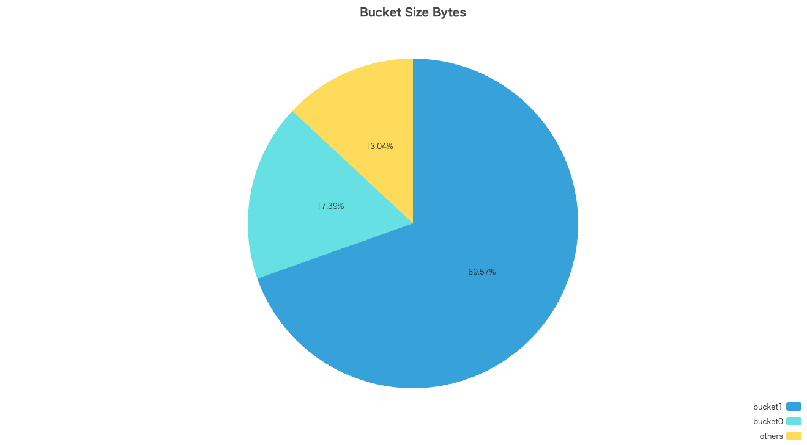

s3bytes
=======

[](https://github.com/nekrassov01/s3bytes/actions/workflows/ci.yaml)
[](https://goreportcard.com/report/github.com/nekrassov01/s3bytes)


s3bytes is a CLI tool that lists the size and number of objects in all buckets in one shot.

Features
--------

- High speed with concurrent processing
- Various output formats
- Simple processing using CloudWatch Metrics API
- Simple command line flags

Options
-------

List of possible values for flags as follows:

| Option                                            | Description                             | Allowed values                                                                                                                                                                                                                                                                                                                                                                                                                                                                                                                                                                                           | Default value                                                                                                                             | Environment Variable  |
| ------------------------------------------------- | --------------------------------------- | -------------------------------------------------------------------------------------------------------------------------------------------------------------------------------------------------------------------------------------------------------------------------------------------------------------------------------------------------------------------------------------------------------------------------------------------------------------------------------------------------------------------------------------------------------------------------------------------------------- | ----------------------------------------------------------------------------------------------------------------------------------------- | --------------------- |
| `--profile value` `-p value`                      | set aws profile                         | -                                                                                                                                                                                                                                                                                                                                                                                                                                                                                                                                                                                                        | -                                                                                                                                         | `AWS_PROFILE`         |
| `--log-level value` `-l value`                    | set log level                           | `debug` `info` `warn` `error`                                                                                                                                                                                                                                                                                                                                                                                                                                                                                                                                                                            | `info`                                                                                                                                    | `S3BYTES_LOG_LEVEL`   |
| `--region value1,value2...` `-r value1,value2...` | set target regions                      | `af-south-1` `ap-east-1` `ap-northeast-1` `ap-northeast-2` `ap-northeast-3` `ap-south-1` `ap-south-2` `ap-southeast-1` `ap-southeast-2` `ap-southeast-3` `ap-southeast-4` `ap-southeast-5` `ap-southeast-7` `ca-central-1` `ca-west-1` `eu-central-1` `eu-central-2` `eu-north-1` `eu-south-1` `eu-south-2` `eu-west-1` `eu-west-2` `eu-west-3` `il-central-1` `me-central-1` `me-south-1` `mx-central-1` `sa-east-1` `us-east-1` `us-east-2` `us-west-1` `us-west-2`                                                                                                                                    | [All regions with no opt-in](https://docs.aws.amazon.com/AWSEC2/latest/UserGuide/using-regions-availability-zones.html#concepts-regionsz) | -                     |
| `--prefix value` `-P value`                       | set bucket name prefix                  | -                                                                                                                                                                                                                                                                                                                                                                                                                                                                                                                                                                                                        | -                                                                                                                                         | -                     |
| `--filter value` `-f value`                       | set filter expression for metric values | Key: `bytes` `Bytes` `value` `Value`</br>Examples: `bytes > 2` `Bytes >= 4` `value < 8` `Value <= 16` `bytes == 32` `Bytes != 64`                                                                                                                                                                                                                                                                                                                                                                                                                                                                        | -                                                                                                                                         | -                     |
| `--metric-name value` `-m value`                  | set metric name of cloudwatch metrics   | `BucketSizeBytes` `NumberOfObjects`                                                                                                                                                                                                                                                                                                                                                                                                                                                                                                                                                                      | `BucketSizeBytes`                                                                                                                         | -                     |
| `--storage-type value` `-s value`                 | set storage type of s3 objects          | `StandardStorage` `IntelligentTieringFAStorage` `IntelligentTieringIAStorage` `IntelligentTieringAAStorage` `IntelligentTieringAIAStorage` `IntelligentTieringDAAStorage` `StandardIAStorage` `StandardIASizeOverhead` `StandardIAObjectOverhead` `OneZoneIAStorage` `OneZoneIASizeOverhead` `ReducedRedundancyStorage` `GlacierIRSizeOverhead` `GlacierInstantRetrievalStorage` `GlacierStorage` `GlacierStagingStorage` `GlacierObjectOverhead` `GlacierS3ObjectOverhead` `DeepArchiveStorage` `DeepArchiveObjectOverhead` `DeepArchiveS3ObjectOverhead` `DeepArchiveStagingStorage` `AllStorageTypes` | `StandardStorage`                                                                                                                         | -                     |
| `--output value` `-o value`                       | set output type                         | `json` `prettyjson` `text` `compressedtext` `markdown` `backlog` `tsv` `chart`                                                                                                                                                                                                                                                                                                                                                                                                                                                                                                                           | `text`                                                                                                                                    | `S3BYTES_OUTPUT_TYPE` |
| `--help` `-h`                                     | show help                               | -                                                                                                                                                                                                                                                                                                                                                                                                                                                                                                                                                                                                        | -                                                                                                                                         | -                     |
| `--version` `-v`                                  | print the version                       | -                                                                                                                                                                                                                                                                                                                                                                                                                                                                                                                                                                                                        | -                                                                                                                                         | -                     |

Output type
-----------

Pretty JSON format

```json
[
  {
    "BucketName": "bucket0",
    "Region": "ap-northeast-1",
    "MetricName": "BucketSizeBytes",
    "StorageType": "StandardStorage",
    "Value": 23373655,
  },
  {
    "BucketName": "bucket1",
    "Region": "ap-northeast-2",
    "MetricName": "BucketSizeBytes",
    "StorageType": "StandardStorage",
    "Value": 134614,
  },
  {
    "BucketName": "bucket2",
    "Region": "us-east-1",
    "MetricName": "BucketSizeBytes",
    "StorageType": "StandardStorage",
    "Value": 0,
  }
]
```

Text table format

```text
$ s3bytes -o text
+------------+----------------+-----------------+-----------------+----------+
| BucketName | Region         | MetricName      | StorageType     | Value    |
+------------+----------------+-----------------+-----------------+----------+
| bucket0    | ap-northeast-1 | BucketSizeBytes | StandardStorage | 23373655 |
+------------+----------------+-----------------+-----------------+----------+
| bucket1    | ap-northeast-2 | BucketSizeBytes | StandardStorage |   134614 |
+------------+----------------+-----------------+-----------------+----------+
| bucket2    | us-east-1      | BucketSizeBytes | StandardStorage |        0 |
+------------+----------------+-----------------+-----------------+----------+
```

Compressed text table format

```text
$ s3bytes -o compressedtext
+------------+----------------+-----------------+-----------------+----------+
| BucketName | Region         | MetricName      | StorageType     | Value    |
+------------+----------------+-----------------+-----------------+----------+
| bucket0    | ap-northeast-1 | BucketSizeBytes | StandardStorage | 23373655 |
| bucket1    | ap-northeast-2 | BucketSizeBytes | StandardStorage |   134614 |
| bucket2    | us-east-1      | BucketSizeBytes | StandardStorage |        0 |
+------------+----------------+-----------------+-----------------+----------+
```

Markdown table format

```text
$ s3bytes -o markdown
| BucketName | Region         | MetricName      | StorageType     | Value    |
| ---------- | -------------- | --------------- | --------------- | -------- |
| bucket0    | ap-northeast-1 | BucketSizeBytes | StandardStorage | 23373655 |
| bucket1    | ap-northeast-2 | BucketSizeBytes | StandardStorage | 134614   |
| bucket2    | us-east-1      | BucketSizeBytes | StandardStorage | 0        |
```

Backlog table format

```text
$ s3bytes -o backlog
| BucketName | Region         | MetricName      | StorageType     | Value    |h
| bucket0    | ap-northeast-1 | BucketSizeBytes | StandardStorage | 23373655 |
| bucket1    | ap-northeast-2 | BucketSizeBytes | StandardStorage | 134614   |
| bucket2    | us-east-1      | BucketSizeBytes | StandardStorage | 0        |
```

And visualization is also possible. Displays a pie chart in your browser in one shot!!



Installation
------------

Install with homebrew

```sh
brew install nekrassov01/tap/s3bytes
```

Install with go

```sh
go install github.com/nekrassov01/s3bytes
```

Or download binary from [releases](https://github.com/nekrassov01/s3bytes/releases)

Shell completion
----------------

Supported Shells are as follows:

- bash
- zsh
- fish
- pwsh

```sh
s3bytes completion bash|zsh|fish|pwsh
```

Todo
----

- [x] Add code comment
- [x] Implement visualization
- [ ] Support directory buckets if possible
- [ ] Support table buckets if possible
- [ ] Support vector buckets if possible
- [ ] Support streaming output (in github.com/nekrassov01/mintab)

Author
------

[nekrassov01](https://github.com/nekrassov01)

License
-------

[MIT](https://github.com/nekrassov01/s3bytes/blob/main/LICENSE)
